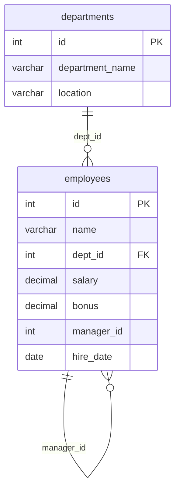

<p align="center">
  
</p>

<p align="center">
  
</p>

<p align="center">
  
  
  
  
</p>

---

## 🧠 What I Did

Week 3 of a Data Science internship: write SQL against a small HR database of **20 employees across 5 departments**. **Individual assignment.**

The assignment shipped a **MySQL** schema, but I worked in **SQL Server (SSMS)** — so the first task was porting it: replacing `DROP TABLE IF EXISTS` with `IF OBJECT_ID(...) IS NOT NULL DROP TABLE`, swapping `LIMIT` for `TOP` / window-function filters, and keeping the foreign key from `employees.dept_id` to `departments.id`.



## 📋 What's Covered

| Section | Queries | Concepts |
|---|:-:|---|
| **1 — Setup** | schema + seed | `CREATE TABLE`, PK/FK, `INSERT`, MySQL → T-SQL conversion |
| **2 — Medium** | 10 | `GROUP BY` / `HAVING`, `INNER` and `LEFT JOIN`, **self-join** (employee ↔ manager), subqueries, `EXISTS`, `COALESCE` for NULL bonuses, date filtering |
| **3 — Hard** | 8 | `RANK()` and `ROW_NUMBER()` with `PARTITION BY`, top-N per group, `LEAD()`, **CTEs**, `UNION`, correlated subqueries, `EXISTS` (managers with direct reports) |

### Example — top 2 earners per department

```sql
WITH RankedEmployees AS (
    SELECT *,
           ROW_NUMBER() OVER (PARTITION BY department ORDER BY salary DESC) AS RowNum
    FROM employees
)
SELECT *
FROM RankedEmployees
WHERE RowNum <= 2;
```

## 📂 Files

| File | Contents |
|---|---|
| `section1_queries.sql` | Schema (SQL Server syntax) and seed data |
| `section2_3_queries.sql` | Medium and hard queries, each commented with its question |
| `screenshots/` | Result grids from SSMS |

**Run:** open both files in SSMS, execute `section1_queries.sql` first, then any query from `section2_3_queries.sql`.

<p align="center">
  
</p>
